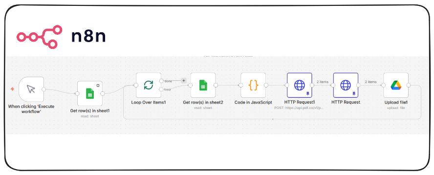

# N8N Automated PDF Form Filling Workflow


## Overview

This N8N workflow automates the process of filling multiple PDF forms using data from Google Sheets and PDF.co API. What previously took hours of manual data entry now runs automatically — filling every form for every person in minutes, with zero human intervention.

---

## How It Saves Time

### Manual Process (Before)
- Open Google Sheet → copy person's data.
- Open PDF form → paste data field by field.
- Save filled PDF → rename it → upload to Google Drive.
- Repeat for every form × every person.

For **20 people × 20 forms = 400 manual operations** — easily a full day's work.

### Automated Process (After)
- Trigger the workflow once.
- All 400 PDFs are filled, named, and uploaded automatically.
- Total time: **minutes, not hours**.

### Time Savings Breakdown

| Task | Manual | Automated |
|---|---|---|
| Fill 1 form for 1 person | ~5 mins | ~3 seconds |
| Fill 20 forms for 1 person | ~100 mins | ~60 seconds |
| Fill 20 forms for 20 people | ~2,000 mins | ~20 minutes |
| Human errors | Frequent | Zero |

---

## Real-World Use Cases

| # | Industry | Who Uses It | Forms Involved | Time Saved |
|---|---|---|---|---|
| 1 | **HR & Onboarding** | HR teams onboarding new hires | Offer letters, tax forms, NDAs, benefits enrollment, emergency contact forms | Days → Minutes |
| 2 | **Healthcare** | Clinics, hospitals, private practices | Patient intake, consent forms, insurance claims, medical history documents | Hours per patient → Seconds |
| 3 | **Legal** | Law firms, legal departments | Contracts, affidavits, court filings, client agreements | Hours per client → Minutes |
| 4 | **Education** | Schools, universities, admin teams | Enrollment forms, scholarship applications, financial aid, parental consent | Days per intake → Minutes |
| 5 | **Real Estate** | Agencies, brokers, property managers | Lease agreements, disclosure forms, mortgage applications, inspection reports | Hours per deal → Minutes |
---

## High-Level Challenges & How This Workflow Solves Them

### Challenge 1: Different Forms Have Different Fields
**Problem:** Each PDF form has a unique set of field names. Form A may need `full_name` while Form B uses `Name`. Sending wrong field names causes forms to be blank or errors to occur.

**Solution:** The Field Mapping tab in Google Sheets acts as a translation layer — mapping each PDF's internal field names to the corresponding Google Sheet column. The Code node dynamically builds the correct payload for each form, ensuring only relevant fields are sent.

---

### Challenge 2: Data Consistency and Human Error
**Problem:** Manual form filling leads to typos, copy-paste errors, missing fields, and inconsistent formatting across documents — especially when the same data appears on multiple forms.

**Solution:** Data is entered once in Google Sheets and flows automatically into every form. The Code node reads values programmatically, eliminating transcription errors entirely.

---

## Workflow Architecture

```
Google Sheets
        ↓
Split in Batches
        ↓
Google Sheets (Field Mapping Tab)
        ↓
Code Node (Build API payload per form)
        ↓
HTTP Request → PDF.co (Fill PDF)
        ↓
HTTP Request → Download filled PDF
        ↓
Google Drive (Upload filled PDF)
```


---

## Prerequisites

- N8N (self-hosted)
- Google Sheets with people data and field mapping tab.
- PDF.co account (free tier: 200 credits/month).
- Google Drive output folder
- PDFs uploaded to PDF.co file storage.

---

## Notes

- PDF.co output URLs expire after 1 hour — the Download and Upload nodes must run immediately after the fill step
- Free plan supports up to 200 API credits/month — each form fill costs 21 credits for 1 page.
- The workflow handles missing fields gracefully — if a sheet column has no value, that field is skipped

## Video
<div>
    <a href="https://www.loom.com/share/744742334f3349909b50520bd0958187">
      
    </a>
  </div>

*Note: Video generated with Notebook LM. AI may introduce errors; human oversight applies.*
